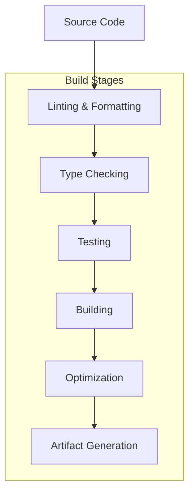

# RIMSS E-Commerce Platform - Build Process Guide

## 1. Build Overview

### 1.1 Build Architecture


### 1.2 Build Environments
- **Development**: Hot reloading, debug information
- **Staging**: Production-like, testing environment
- **Production**: Optimized, minified, performance-focused

## 2. Prerequisites

### 2.1 Required Software
```bash
# Node.js and npm
node --version  # v16.x or higher
npm --version   # v8.x or higher

# Git
git --version

# Docker (optional)
docker --version
docker-compose --version
```

### 2.2 Environment Setup
```bash
# Install dependencies
npm install

# Set up environment variables
cp client/.env.example client/.env
cp server/.env.example server/.env
```

## 3. Frontend Build Process

### 3.1 Development Build
```bash
# Navigate to client directory
cd client

# Install dependencies
npm install

# Start development server
npm start
```

**Development Build Features:**
- Hot module replacement
- Source maps enabled
- Unminified code
- Development warnings
- Fast refresh

### 3.2 Production Build
```bash
# Create production build
npm run build

# Build output structure
build/
├── static/
│   ├── css/
│   │   ├── main.[hash].css
│   │   └── main.[hash].css.map
│   ├── js/
│   │   ├── main.[hash].js
│   │   └── main.[hash].js.map
│   └── media/
│       └── [hash].[ext]
├── asset-manifest.json
├── favicon.ico
├── index.html
├── manifest.json
└── robots.txt
```

### 3.3 Build Configuration
```javascript
// webpack.config.js
module.exports = {
  mode: process.env.NODE_ENV === 'production' ? 'production' : 'development',
  
  entry: './src/index.tsx',
  
  output: {
    path: path.resolve(__dirname, 'build'),
    filename: 'static/js/[name].[contenthash:8].js',
    chunkFilename: 'static/js/[name].[contenthash:8].chunk.js',
    publicPath: '/'
  },
  
  optimization: {
    splitChunks: {
      chunks: 'all',
      cacheGroups: {
        vendor: {
          test: /[\\/]node_modules[\\/]/,
          name: 'vendors',
          chunks: 'all'
        }
      }
    },
    runtimeChunk: 'single'
  },
  
  module: {
    rules: [
      {
        test: /\.(ts|tsx)$/,
        exclude: /node_modules/,
        use: 'ts-loader'
      },
      {
        test: /\.css$/,
        use: ['style-loader', 'css-loader', 'postcss-loader']
      }
    ]
  }
};
```

### 3.4 TypeScript Configuration
```json
{
  "compilerOptions": {
    "target": "es5",
    "lib": ["dom", "dom.iterable", "es6"],
    "allowJs": true,
    "skipLibCheck": true,
    "esModuleInterop": true,
    "allowSyntheticDefaultImports": true,
    "strict": true,
    "forceConsistentCasingInFileNames": true,
    "noFallthroughCasesInSwitch": true,
    "module": "esnext",
    "moduleResolution": "node",
    "resolveJsonModule": true,
    "isolatedModules": true,
    "noEmit": true,
    "jsx": "react-jsx"
  },
  "include": ["src"]
}
```

## 4. Backend Build Process

### 4.1 Development Build
```bash
# Navigate to server directory
cd server

# Install dependencies
npm install

# Start development server
npm run dev
```

**Development Features:**
- Nodemon for auto-restart
- Source maps
- Debug logging
- Hot reloading

### 4.2 Production Build
```bash
# Build TypeScript to JavaScript
npm run build

# Build output structure
dist/
├── controllers/
├── middleware/
├── models/
├── routes/
├── scripts/
├── index.js
└── package.json
```

### 4.3 TypeScript Configuration
```json
{
  "compilerOptions": {
    "target": "es2020",
    "module": "commonjs",
    "lib": ["es2020"],
    "outDir": "./dist",
    "rootDir": "./src",
    "strict": true,
    "esModuleInterop": true,
    "skipLibCheck": true,
    "forceConsistentCasingInFileNames": true,
    "resolveJsonModule": true,
    "declaration": true,
    "declarationMap": true,
    "sourceMap": true
  },
  "include": ["src/**/*"],
  "exclude": ["node_modules", "dist"]
}
```

## 5. Build Scripts

### 5.1 Package.json Scripts
```json
{
  "scripts": {
    "dev": "concurrently \"npm run dev:client\" \"npm run dev:server\"",
    "dev:client": "cd client && npm start",
    "dev:server": "cd server && npm run dev",
    
    "build": "npm run build:client && npm run build:server",
    "build:client": "cd client && npm run build",
    "build:server": "cd server && npm run build",
    
    "test": "npm run test:client && npm run test:server",
    "test:client": "cd client && npm test",
    "test:server": "cd server && npm test",
    
    "lint": "npm run lint:client && npm run lint:server",
    "lint:client": "cd client && npm run lint",
    "lint:server": "cd server && npm run lint",
    
    "format": "npm run format:client && npm run format:server",
    "format:client": "cd client && npm run format",
    "format:server": "cd server && npm run format"
  }
}
```

### 5.2 Build Pipeline
```bash
#!/bin/bash
# build.sh

set -e

echo "Starting build process..."

# Install dependencies
echo "Installing dependencies..."
npm install
cd client && npm install && cd ..
cd server && npm install && cd ..

# Run linting
echo "Running linting..."
npm run lint

# Run tests
echo "Running tests..."
npm run test

# Build applications
echo "Building applications..."
npm run build

# Generate build artifacts
echo "Generating build artifacts..."
npm run generate-artifacts

echo "Build completed successfully!"
```

## 6. Docker Build Process

### 6.1 Multi-stage Dockerfile
```dockerfile
# Frontend Dockerfile
FROM node:16-alpine AS frontend-builder

WORKDIR /app/client
COPY client/package*.json ./
RUN npm ci --only=production

COPY client/ ./
RUN npm run build

# Production frontend
FROM nginx:alpine
COPY --from=frontend-builder /app/client/build /usr/share/nginx/html
COPY nginx.conf /etc/nginx/nginx.conf
EXPOSE 80
CMD ["nginx", "-g", "daemon off;"]

# Backend Dockerfile
FROM node:16-alpine AS backend-builder

WORKDIR /app/server
COPY server/package*.json ./
RUN npm ci --only=production

COPY server/ ./
RUN npm run build

# Production backend
FROM node:16-alpine
WORKDIR /app
COPY --from=backend-builder /app/server/dist ./dist
COPY --from=backend-builder /app/server/package*.json ./
RUN npm ci --only=production

EXPOSE 5000
CMD ["node", "dist/index.js"]
```

### 6.2 Docker Compose Build
```yaml
version: '3.8'

services:
  frontend:
    build:
      context: .
      dockerfile: client/Dockerfile
    ports:
      - "80:80"
    environment:
      - NODE_ENV=production

  backend:
    build:
      context: .
      dockerfile: server/Dockerfile
    ports:
      - "5000:5000"
    environment:
      - NODE_ENV=production
      - MONGODB_URI=${MONGODB_URI}
    depends_on:
      - mongodb
      - redis

  mongodb:
    image: mongo:5
    ports:
      - "27017:27017"
    volumes:
      - mongodb_data:/data/db

  redis:
    image: redis:6-alpine
    ports:
      - "6379:6379"

volumes:
  mongodb_data:
```

## 7. Build Optimization

### 7.1 Frontend Optimization
```javascript
// Bundle Analyzer
const { BundleAnalyzerPlugin } = require('webpack-bundle-analyzer');

module.exports = {
  plugins: [
    new BundleAnalyzerPlugin({
      analyzerMode: 'static',
      openAnalyzer: false
    })
  ],
  
  optimization: {
    minimize: true,
    minimizer: [
      new TerserPlugin({
        terserOptions: {
          compress: {
            drop_console: true,
            drop_debugger: true
          }
        }
      })
    ],
    
    splitChunks: {
      chunks: 'all',
      maxInitialRequests: Infinity,
      minSize: 0,
      cacheGroups: {
        vendor: {
          test: /[\\/]node_modules[\\/]/,
          name(module) {
            const packageName = module.context.match(
              /[\\/]node_modules[\\/](.*?)([\\/]|$)/
            )[1];
            return `vendor.${packageName.replace('@', '')}`;
          }
        }
      }
    }
  }
};
```

### 7.2 Backend Optimization
```javascript
// PM2 Configuration
module.exports = {
  apps: [{
    name: 'rimss-backend',
    script: 'dist/index.js',
    instances: 'max',
    exec_mode: 'cluster',
    env: {
      NODE_ENV: 'production',
      PORT: 5000
    },
    env_production: {
      NODE_ENV: 'production',
      PORT: 5000
    }
  }]
};
```

## 8. Build Validation

### 8.1 Pre-build Checks
```bash
#!/bin/bash
# pre-build.sh

echo "Running pre-build checks..."

# Check Node.js version
NODE_VERSION=$(node --version)
REQUIRED_VERSION="v16.0.0"

if [ "$(printf '%s\n' "$REQUIRED_VERSION" "$NODE_VERSION" | sort -V | head -n1)" != "$REQUIRED_VERSION" ]; then
    echo "Error: Node.js version $NODE_VERSION is less than required $REQUIRED_VERSION"
    exit 1
fi

# Check for required environment variables
REQUIRED_ENV_VARS=("MONGODB_URI" "JWT_SECRET" "STRIPE_SECRET_KEY")

for var in "${REQUIRED_ENV_VARS[@]}"; do
    if [ -z "${!var}" ]; then
        echo "Error: Required environment variable $var is not set"
        exit 1
    fi
done

# Check for TypeScript errors
echo "Checking TypeScript..."
cd client && npm run type-check
cd ../server && npm run type-check

echo "Pre-build checks passed!"
```

### 8.2 Post-build Validation
```bash
#!/bin/bash
# post-build.sh

echo "Running post-build validation..."

# Check build artifacts
if [ ! -d "client/build" ]; then
    echo "Error: Frontend build directory not found"
    exit 1
fi

if [ ! -d "server/dist" ]; then
    echo "Error: Backend build directory not found"
    exit 1
fi

# Run integration tests
echo "Running integration tests..."
npm run test:integration

# Check bundle size
echo "Checking bundle size..."
cd client
npm run analyze-bundle

echo "Post-build validation completed!"
```

## 9. Build Artifacts

### 9.1 Artifact Structure
```
build-artifacts/
├── frontend/
│   ├── build/
│   ├── package.json
│   └── README.md
├── backend/
│   ├── dist/
│   ├── package.json
│   └── README.md
├── docker/
│   ├── frontend.tar
│   └── backend.tar
├── documentation/
│   ├── api-docs/
│   └── deployment-guide/
└── reports/
    ├── test-results/
    ├── coverage/
    └── bundle-analysis/
```

### 9.2 Artifact Generation
```bash
#!/bin/bash
# generate-artifacts.sh

echo "Generating build artifacts..."

# Create artifacts directory
mkdir -p build-artifacts

# Copy frontend build
cp -r client/build build-artifacts/frontend/
cp client/package.json build-artifacts/frontend/

# Copy backend build
cp -r server/dist build-artifacts/backend/
cp server/package.json build-artifacts/backend/

# Generate Docker images
docker build -t rimss-frontend:latest client/
docker build -t rimss-backend:latest server/

# Save Docker images
docker save rimss-frontend:latest > build-artifacts/docker/frontend.tar
docker save rimss-backend:latest > build-artifacts/docker/backend.tar

# Generate documentation
npm run generate-docs

# Copy test reports
cp -r client/coverage build-artifacts/reports/
cp -r server/coverage build-artifacts/reports/

echo "Build artifacts generated successfully!"
```

## 10. Build Monitoring

### 10.1 Build Metrics
```javascript
// Build performance monitoring
const buildMetrics = {
  startTime: Date.now(),
  stages: {},
  
  startStage(stageName) {
    this.stages[stageName] = {
      startTime: Date.now()
    };
  },
  
  endStage(stageName) {
    if (this.stages[stageName]) {
      this.stages[stageName].endTime = Date.now();
      this.stages[stageName].duration = 
        this.stages[stageName].endTime - this.stages[stageName].startTime;
    }
  },
  
  getReport() {
    const totalTime = Date.now() - this.startTime;
    return {
      totalTime,
      stages: this.stages,
      summary: Object.entries(this.stages).map(([name, data]) => ({
        stage: name,
        duration: data.duration
      }))
    };
  }
};
```

### 10.2 Build Notifications
```javascript
// Build notification system
const notifyBuildStatus = (status, details) => {
  const message = {
    status,
    timestamp: new Date().toISOString(),
    details,
    environment: process.env.NODE_ENV
  };
  
  // Send to Slack/Discord
  if (process.env.WEBHOOK_URL) {
    fetch(process.env.WEBHOOK_URL, {
      method: 'POST',
      headers: { 'Content-Type': 'application/json' },
      body: JSON.stringify(message)
    });
  }
  
  // Log to file
  fs.appendFileSync('build.log', JSON.stringify(message) + '\n');
};
```

## 11. Troubleshooting

### 11.1 Common Build Issues
```bash
# Memory issues
export NODE_OPTIONS="--max-old-space-size=4096"

# Permission issues
sudo chown -R $USER:$USER .

# Cache issues
npm cache clean --force
rm -rf node_modules package-lock.json

# TypeScript issues
rm -rf dist build
npm run build
```

### 11.2 Build Debugging
```bash
# Enable verbose logging
npm run build --verbose

# Check build configuration
npm run build --dry-run

# Analyze bundle
npm run analyze

# Check dependencies
npm ls
npm audit
```

This build process guide provides a comprehensive overview of building the RIMSS e-commerce platform, including development, staging, and production builds, with proper optimization and validation steps. 