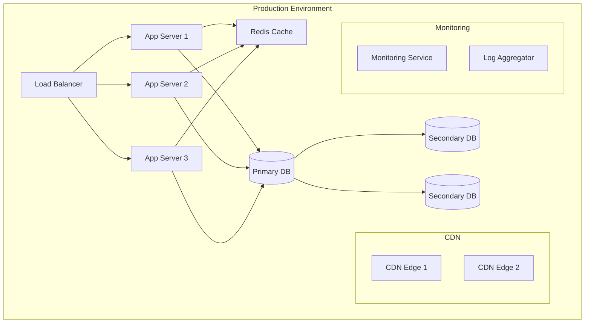

# RIMSS E-Commerce Platform - Deployment Guide

## 1. Deployment Architecture



## 2. Prerequisites

### 2.1 Infrastructure Requirements
- AWS Account with appropriate IAM roles
- Domain name and SSL certificates
- MongoDB Atlas account
- Redis Enterprise/AWS ElastiCache
- CI/CD pipeline (GitHub Actions)

### 2.2 Environment Variables
```env
# Production Environment Variables
NODE_ENV=production
PORT=80
MONGODB_URI=mongodb+srv://...
REDIS_URL=redis://...
JWT_SECRET=...
STRIPE_SECRET_KEY=...
AWS_ACCESS_KEY=...
AWS_SECRET_KEY=...
```

## 3. Deployment Process

### 3.1 Build Process
```bash
# Frontend Build
cd client
npm run build

# Backend Build
cd ../server
npm run build
```

### 3.2 Docker Configuration
```dockerfile
# Frontend Dockerfile
FROM node:16-alpine
WORKDIR /app
COPY package*.json ./
RUN npm install
COPY . .
RUN npm run build
EXPOSE 80
CMD ["npm", "start"]

# Backend Dockerfile
FROM node:16-alpine
WORKDIR /app
COPY package*.json ./
RUN npm install
COPY . .
RUN npm run build
EXPOSE 5000
CMD ["npm", "start"]
```

### 3.3 Docker Compose
```yaml
version: '3.8'

services:
  frontend:
    build: ./client
    ports:
      - "80:80"
    environment:
      - NODE_ENV=production
    depends_on:
      - backend

  backend:
    build: ./server
    ports:
      - "5000:5000"
    environment:
      - NODE_ENV=production
      - MONGODB_URI=${MONGODB_URI}
    depends_on:
      - redis
      - mongodb

  redis:
    image: redis:6-alpine
    ports:
      - "6379:6379"

  mongodb:
    image: mongo:5
    ports:
      - "27017:27017"
    volumes:
      - mongodb_data:/data/db

volumes:
  mongodb_data:
```

## 4. Cloud Infrastructure Setup

### 4.1 AWS ECS Configuration
```json
{
  "family": "rimss-app",
  "containerDefinitions": [
    {
      "name": "frontend",
      "image": "rimss-frontend:latest",
      "memory": 512,
      "cpu": 256,
      "portMappings": [
        {
          "containerPort": 80,
          "hostPort": 80
        }
      ]
    },
    {
      "name": "backend",
      "image": "rimss-backend:latest",
      "memory": 1024,
      "cpu": 512,
      "portMappings": [
        {
          "containerPort": 5000,
          "hostPort": 5000
        }
      ]
    }
  ]
}
```

### 4.2 Load Balancer Configuration
```json
{
  "Type": "Application",
  "Scheme": "internet-facing",
  "SecurityGroups": ["sg-xxxxx"],
  "Subnets": ["subnet-xxxxx", "subnet-yyyyy"],
  "Listeners": [
    {
      "Protocol": "HTTPS",
      "Port": 443,
      "Certificates": ["arn:aws:acm:..."],
      "DefaultActions": [
        {
          "Type": "forward",
          "TargetGroupArn": "arn:aws:elasticloadbalancing:..."
        }
      ]
    }
  ]
}
```

## 5. Database Setup

### 5.1 MongoDB Atlas Configuration
```javascript
// MongoDB Replica Set
{
  "replSetName": "rimss-prod",
  "members": [
    {
      "_id": 0,
      "host": "mongodb-0.rimss.com:27017"
    },
    {
      "_id": 1,
      "host": "mongodb-1.rimss.com:27017"
    },
    {
      "_id": 2,
      "host": "mongodb-2.rimss.com:27017"
    }
  ]
}
```

### 5.2 Redis Cluster Setup
```bash
# Redis Cluster Configuration
redis-cli --cluster create \
  redis-1:6379 \
  redis-2:6379 \
  redis-3:6379 \
  --cluster-replicas 1
```

## 6. CI/CD Pipeline

### 6.1 GitHub Actions Workflow
```yaml
name: Deploy to Production

on:
  push:
    branches: [main]

jobs:
  deploy:
    runs-on: ubuntu-latest
    
    steps:
      - uses: actions/checkout@v2
      
      - name: Configure AWS
        uses: aws-actions/configure-aws-credentials@v1
        with:
          aws-access-key-id: ${{ secrets.AWS_ACCESS_KEY_ID }}
          aws-secret-access-key: ${{ secrets.AWS_SECRET_ACCESS_KEY }}
          aws-region: us-east-1
      
      - name: Build and Push Docker Images
        run: |
          docker build -t rimss-frontend ./client
          docker build -t rimss-backend ./server
          docker push rimss-frontend
          docker push rimss-backend
      
      - name: Deploy to ECS
        run: |
          aws ecs update-service --cluster rimss-cluster --service rimss-service --force-new-deployment
```

## 7. Monitoring Setup

### 7.1 CloudWatch Configuration
```json
{
  "logConfiguration": {
    "logDriver": "awslogs",
    "options": {
      "awslogs-group": "/ecs/rimss",
      "awslogs-region": "us-east-1",
      "awslogs-stream-prefix": "ecs"
    }
  }
}
```

### 7.2 Prometheus Configuration
```yaml
global:
  scrape_interval: 15s

scrape_configs:
  - job_name: 'rimss-app'
    static_configs:
      - targets: ['localhost:9090']

  - job_name: 'node-exporter'
    static_configs:
      - targets: ['localhost:9100']
```

## 8. Backup Strategy

### 8.1 Database Backup
```bash
# MongoDB Backup Script
#!/bin/bash
DATE=$(date +%Y%m%d)
mongodump --uri $MONGODB_URI --out /backup/mongodb_$DATE
aws s3 cp /backup/mongodb_$DATE s3://rimss-backup/mongodb/
```

### 8.2 Application Backup
```bash
# Application State Backup
#!/bin/bash
DATE=$(date +%Y%m%d)
tar -czf /backup/app_$DATE.tar.gz /app/uploads
aws s3 cp /backup/app_$DATE.tar.gz s3://rimss-backup/app/
```

## 9. SSL/TLS Configuration

### 9.1 Nginx Configuration
```nginx
server {
    listen 443 ssl;
    server_name rimss.com;

    ssl_certificate /etc/nginx/ssl/rimss.crt;
    ssl_certificate_key /etc/nginx/ssl/rimss.key;
    
    ssl_protocols TLSv1.2 TLSv1.3;
    ssl_ciphers HIGH:!aNULL:!MD5;

    location / {
        proxy_pass http://frontend;
        proxy_set_header Host $host;
        proxy_set_header X-Real-IP $remote_addr;
    }

    location /api {
        proxy_pass http://backend:5000;
        proxy_set_header Host $host;
        proxy_set_header X-Real-IP $remote_addr;
    }
}
```

## 10. Rollback Procedure

### 10.1 Application Rollback
```bash
# Rollback Script
#!/bin/bash
VERSION=$1

# Roll back ECS task definition
aws ecs update-service \
  --cluster rimss-cluster \
  --service rimss-service \
  --task-definition rimss-app:$VERSION

# Roll back database if needed
mongorestore --uri $MONGODB_URI --drop /backup/mongodb_$VERSION
```

### 10.2 Monitoring Rollback
```bash
# Monitor Rollback Script
#!/bin/bash
VERSION=$1

# Check application health
curl -f https://rimss.com/health || exit 1

# Check error rates
ERROR_RATE=$(curl -s https://monitoring.rimss.com/metrics | grep error_rate)
if [ "$ERROR_RATE" -gt 5 ]; then
  echo "High error rate detected"
  exit 1
fi
```

## 11. Performance Optimization

### 11.1 CDN Configuration
```json
{
  "Distribution": {
    "DistributionConfig": {
      "Origins": {
        "Items": [
          {
            "DomainName": "rimss.com",
            "Id": "Frontend"
          }
        ]
      },
      "DefaultCacheBehavior": {
        "TargetOriginId": "Frontend",
        "ViewerProtocolPolicy": "redirect-to-https",
        "MinTTL": 0,
        "DefaultTTL": 86400,
        "MaxTTL": 31536000
      }
    }
  }
}
```

### 11.2 Cache Configuration
```javascript
// Redis Cache Configuration
const cacheConfig = {
  host: process.env.REDIS_HOST,
  port: process.env.REDIS_PORT,
  password: process.env.REDIS_PASSWORD,
  maxRetriesPerRequest: 3,
  retryStrategy: (times) => Math.min(times * 50, 2000)
};
```

## 12. Security Measures

### 12.1 WAF Configuration
```json
{
  "Rules": [
    {
      "Name": "BlockSQLInjection",
      "Priority": 1,
      "Action": {
        "Block": {}
      },
      "Statement": {
        "SqlInjectionMatchStatement": {
          "FieldToMatch": {
            "QueryString": {}
          },
          "TextTransformations": [
            {
              "Priority": 1,
              "Type": "NONE"
            }
          ]
        }
      }
    }
  ]
}
```

### 12.2 Security Groups
```json
{
  "GroupName": "rimss-security-group",
  "Description": "Security group for RIMSS application",
  "IpPermissions": [
    {
      "IpProtocol": "tcp",
      "FromPort": 80,
      "ToPort": 80,
      "IpRanges": [{"CidrIp": "0.0.0.0/0"}]
    },
    {
      "IpProtocol": "tcp",
      "FromPort": 443,
      "ToPort": 443,
      "IpRanges": [{"CidrIp": "0.0.0.0/0"}]
    }
  ]
}
``` 