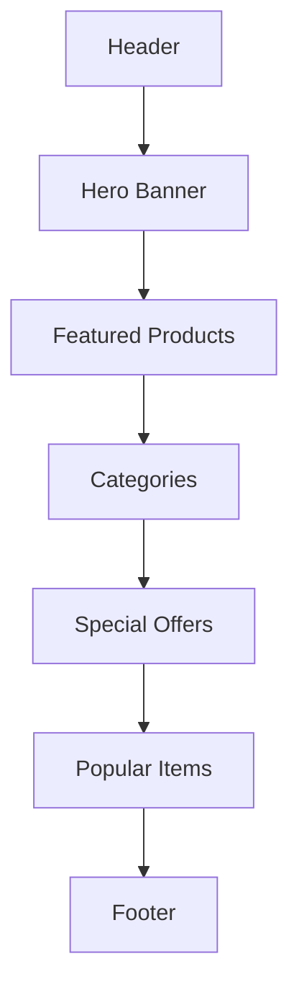
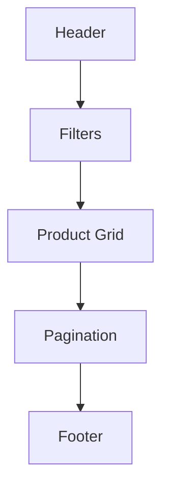
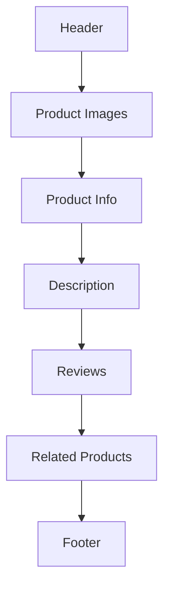

# RIMSS E-Commerce Platform - Functional Specification

## 1. Product Overview

RIMSS is a comprehensive e-commerce platform designed to provide a seamless shopping experience for users while offering robust management capabilities for administrators.

## 2. User Roles

### 2.1 Customer
- Browse products
- Manage shopping cart
- Place orders
- Track order status
- Manage profile
- View order history

### 2.2 Administrator
- Manage products
- Process orders
- Manage users
- View analytics
- Handle returns
- Manage promotions

## 3. Feature Specifications

### 3.1 User Authentication

#### Registration
- Fields:
  - First Name
  - Last Name
  - Email
  - Password
  - Confirm Password
- Validation:
  - Email format
  - Password strength
  - Unique email check
- Success:
  - Account creation
  - Welcome email
  - Automatic login

#### Login
- Fields:
  - Email
  - Password
- Features:
  - Remember me
  - Forgot password
  - Social login (planned)
- Security:
  - Rate limiting
  - Account lockout

### 3.2 Product Management

#### Product Listing
- Display:
  - Grid/List view
  - Product image
  - Name
  - Price
  - Rating
  - Stock status
- Filtering:
  - Category
  - Price range
  - Rating
  - Availability
- Sorting:
  - Price
  - Popularity
  - Latest
  - Rating

#### Product Details
- Information:
  - Multiple images
  - Detailed description
  - Specifications
  - Price
  - Stock status
- Features:
  - Image zoom
  - Color selection
  - Size selection
  - Quantity selection
- Actions:
  - Add to cart
  - Buy now
  - Add to wishlist

### 3.3 Shopping Cart

#### Cart Management
- Features:
  - Add/Remove items
  - Update quantities
  - Save for later
  - Clear cart
- Display:
  - Product details
  - Unit price
  - Subtotal
  - Total items
- Calculations:
  - Subtotal
  - Tax
  - Shipping
  - Total

#### Checkout Process
1. Cart Review
   - Item list
   - Quantities
   - Prices
   - Total

2. Shipping Information
   - Address details
   - Shipping method
   - Delivery options

3. Payment
   - Multiple methods
   - Secure processing
   - Order summary

4. Confirmation
   - Order number
   - Email confirmation
   - Tracking info

### 3.4 Order Management

#### Customer View
- Order List:
  - Order number
  - Date
  - Status
  - Total
- Order Details:
  - Items
  - Shipping info
  - Payment info
  - Status updates

#### Admin View
- Order Processing:
  - View orders
  - Update status
  - Process refunds
  - Generate invoices
- Order Analytics:
  - Sales reports
  - Product performance
  - Customer insights

### 3.5 User Profile

#### Personal Information
- View/Edit:
  - Name
  - Email
  - Phone
  - Password
- Address Book:
  - Multiple addresses
  - Default address
  - Address types

#### Order History
- View:
  - Past orders
  - Order status
  - Reorder option
- Track:
  - Current orders
  - Shipping status
  - Delivery updates

## 4. User Interface Specifications

### 4.1 Layout Components

#### Header
- Logo
- Search bar
- Navigation menu
- Cart icon
- User menu

#### Footer
- Company info
- Quick links
- Social media
- Newsletter signup

#### Navigation
- Categories menu
- User account
- Help/Support
- Special offers

### 4.2 Page Templates

#### Home Page

#### Product List Page

#### Product Detail Page

## 5. Business Rules

### 5.1 Pricing Rules
- Regular pricing
- Discount pricing
- Bulk pricing
- Special offers
- Coupon codes

### 5.2 Inventory Rules
- Stock management
- Low stock alerts
- Out of stock handling
- Backorder rules

### 5.3 Shipping Rules
- Shipping methods
- Shipping zones
- Free shipping rules
- Handling fees

### 5.4 Tax Rules
- Tax calculation
- Tax zones
- Tax exemptions
- Digital goods

## 6. Error Handling

### 6.1 User Errors
- Invalid input
- Missing fields
- Incorrect format
- Duplicate entries

### 6.2 System Errors
- Network issues
- Server errors
- Database errors
- Integration errors

## 7. Performance Requirements

### 7.1 Response Times
- Page load: < 2s
- Search: < 1s
- Cart update: < 500ms
- Checkout: < 3s

### 7.2 Concurrent Users
- Peak load: 1000 users
- Average load: 200 users
- Response time degradation: < 20%

## 8. Security Requirements

### 8.1 Data Protection
- Personal data encryption
- Payment data security
- Session management
- Access control

### 8.2 Transaction Security
- Secure checkout
- Payment verification
- Fraud detection
- Order validation

## 9. Integration Requirements

### 9.1 Payment Gateway
- Credit/Debit cards
- Digital wallets
- Bank transfers
- COD

### 9.2 Shipping Integration
- Multiple carriers
- Rate calculation
- Tracking integration
- Label generation

## 10. Reporting Requirements

### 10.1 Sales Reports
- Daily sales
- Product performance
- Category analysis
- Revenue metrics

### 10.2 Customer Reports
- Purchase history
- Customer behavior
- Demographics
- Satisfaction metrics

## 11. Compliance Requirements

### 11.1 Legal Compliance
- Terms of service
- Privacy policy
- Return policy
- Shipping policy

### 11.2 Industry Standards
- PCI compliance
- Data protection
- Accessibility
- Security standards 