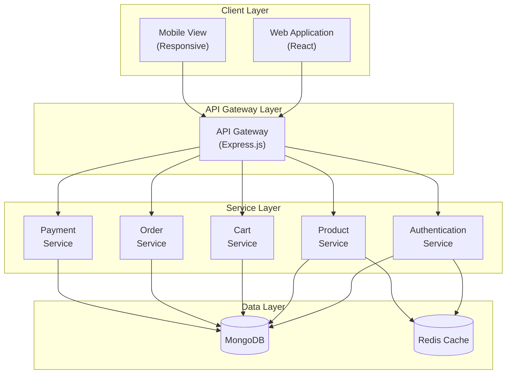

# RIMSS E-Commerce Platform - High-Level Architecture

## 1. System Overview
RIMSS is a modern e-commerce platform built using the MERN (MongoDB, Express.js, React, Node.js) stack. The system follows a microservices-oriented architecture with a clear separation between frontend and backend services.

## 2. Architecture Diagram

## 3. Core Components

### 3.1 Client Layer
- **Web Application**: React-based SPA with TypeScript
- **Mobile View**: Responsive design using Tailwind CSS
- **State Management**: Context API for global state
- **Routing**: React Router for navigation

### 3.2 API Gateway Layer
- **Express.js Server**: Central API gateway
- **Authentication Middleware**: JWT-based auth
- **Request Validation**: Input validation and sanitization
- **Error Handling**: Centralized error management

### 3.3 Service Layer
- **Authentication Service**: User management and auth
- **Product Service**: Product catalog and inventory
- **Cart Service**: Shopping cart management
- **Order Service**: Order processing and tracking
- **Payment Service**: Payment processing (Stripe integration)

### 3.4 Data Layer
- **MongoDB**: Primary database
- **Redis Cache**: Performance optimization
- **File Storage**: Cloud storage for media

## 4. Cross-Cutting Concerns

### 4.1 Security
- JWT Authentication
- HTTPS/SSL
- Input Validation
- XSS Protection
- CSRF Protection
- Rate Limiting

### 4.2 Performance
- Client-side Caching
- Server-side Caching
- Code Splitting
- Lazy Loading
- Image Optimization

### 4.3 Scalability
- Horizontal Scaling
- Load Balancing
- Database Indexing
- Caching Strategies

### 4.4 Monitoring
- Error Logging
- Performance Metrics
- User Analytics
- System Health Monitoring

## 5. Technology Stack

### Frontend
- React 18
- TypeScript
- Tailwind CSS
- React Router
- Context API

### Backend
- Node.js
- Express.js
- MongoDB
- Redis
- JWT

### DevOps
- Git
- npm
- ESLint
- Jest
- Docker (planned)

## 6. Communication Flow

1. Client makes request to API Gateway
2. API Gateway authenticates request
3. Request routed to appropriate service
4. Service processes request
5. Response returned through API Gateway
6. Client receives and renders response

## 7. Future Considerations

- Kubernetes deployment
- Microservices split
- GraphQL implementation
- PWA capabilities
- Mobile app development 