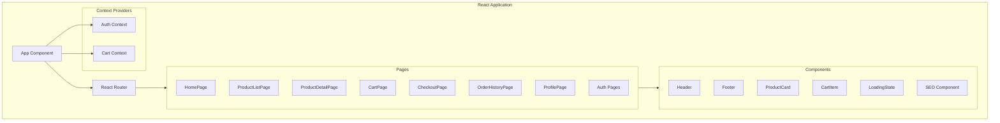
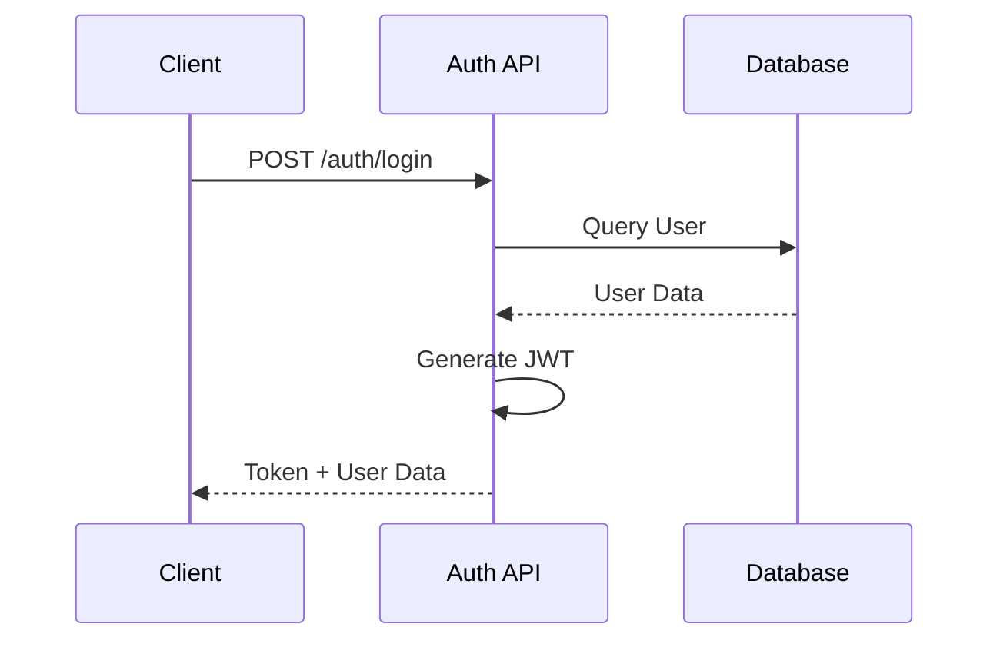
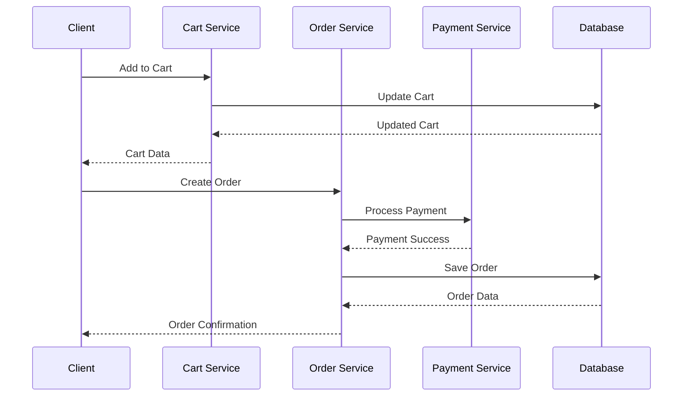
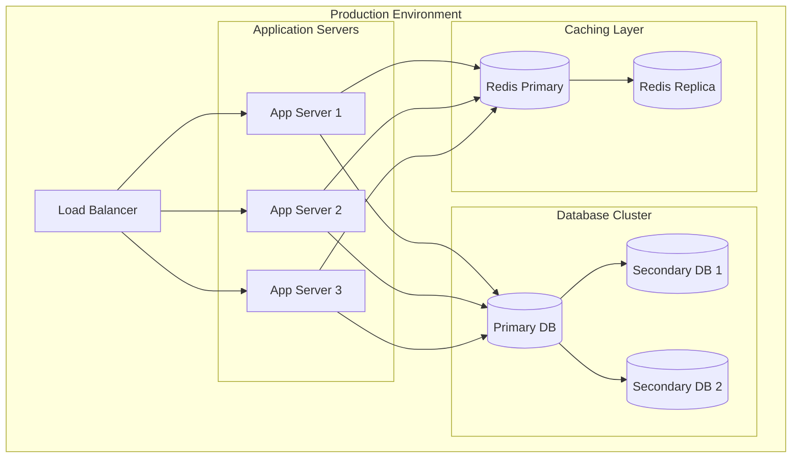

# RIMSS E-Commerce Platform - Low-Level Architecture

## 1. Component Architecture

### 1.1 Frontend Component Structure



### 1.2 Backend Service Architecture

```mermaid
graph TD
    subgraph "Express Application"
        Server[Express Server]
        
        subgraph "Middleware"
            Auth[Auth Middleware]
            Error[Error Handler]
            Logger[Logger]
            Validator[Request Validator]
        end
        
        subgraph "Controllers"
            AuthCtrl[Auth Controller]
            ProdCtrl[Product Controller]
            CartCtrl[Cart Controller]
            OrderCtrl[Order Controller]
            PayCtrl[Payment Controller]
        end
        
        subgraph "Models"
            User[User Model]
            Product[Product Model]
            Cart[Cart Model]
            Order[Order Model]
            Payment[Payment Model]
        end
        
        Server --> Middleware
        Middleware --> Controllers
        Controllers --> Models
    end
```



## 2. Detailed Component Specifications

### 2.1 Frontend Components

#### Authentication Context
```typescript
interface AuthContext {
  user: User | null;
  loading: boolean;
  login: (email: string, password: string) => Promise<void>;
  register: (userData: UserRegistration) => Promise<void>;
  logout: () => void;
}
```

#### Cart Context
```typescript
interface CartContext {
  items: CartItem[];
  loading: boolean;
  addToCart: (product: Product, quantity: number) => Promise<void>;
  updateQuantity: (itemId: string, quantity: number) => Promise<void>;
  removeFromCart: (itemId: string) => Promise<void>;
  clearCart: () => Promise<void>;
}
```

#### Product Components
```typescript
interface ProductCard {
  product: Product;
  onAddToCart: (product: Product) => void;
}

interface ProductDetail {
  product: Product;
  loading: boolean;
  error: Error | null;
}
```

### 2.2 Backend Services

#### Authentication Service
```typescript
interface AuthService {
  register(userData: UserRegistration): Promise<User>;
  login(credentials: LoginCredentials): Promise<AuthResponse>;
  verifyToken(token: string): Promise<User>;
  resetPassword(email: string): Promise<void>;
}
```

#### Product Service
```typescript
interface ProductService {
  getProducts(filters: ProductFilters): Promise<Product[]>;
  getProductById(id: string): Promise<Product>;
  createProduct(data: ProductCreation): Promise<Product>;
  updateProduct(id: string, data: ProductUpdate): Promise<Product>;
  deleteProduct(id: string): Promise<void>;
}
```

## 3. Database Schema

### 3.1 User Collection
```typescript
interface User {
  _id: ObjectId;
  firstName: string;
  lastName: string;
  email: string;
  password: string;
  role: 'user' | 'admin';
  createdAt: Date;
  updatedAt: Date;
}
```

### 3.2 Product Collection
```typescript
interface Product {
  _id: ObjectId;
  name: string;
  description: string;
  price: number;
  category: string;
  images: string[];
  stock: number;
  createdAt: Date;
  updatedAt: Date;
}
```

### 3.3 Order Collection
```typescript
interface Order {
  _id: ObjectId;
  user: ObjectId;
  items: OrderItem[];
  totalAmount: number;
  status: OrderStatus;
  paymentStatus: PaymentStatus;
  createdAt: Date;
  updatedAt: Date;
}
```

## 4. API Endpoints

### 4.1 Authentication API
- POST /api/auth/register
- POST /api/auth/login
- GET /api/auth/me
- POST /api/auth/logout

### 4.2 Product API
- GET /api/products
- GET /api/products/:id
- POST /api/products
- PUT /api/products/:id
- DELETE /api/products/:id

### 4.3 Cart API
- GET /api/cart
- POST /api/cart/items
- PUT /api/cart/items/:id
- DELETE /api/cart/items/:id

### 4.4 Order API
- GET /api/orders
- POST /api/orders
- GET /api/orders/:id
- PUT /api/orders/:id/status

## 5. Data Flow Diagrams

### 5.1 Authentication Flow



### 5.2 Purchase Flow



## 6. Security Implementation

### 6.1 Authentication Flow
```typescript
// JWT Token Structure
interface JWTPayload {
  userId: string;
  role: string;
  iat: number;
  exp: number;
}

// Authentication Middleware
const authenticate = async (req: Request, res: Response, next: NextFunction) => {
  try {
    const token = req.headers.authorization?.split(' ')[1];
    const decoded = jwt.verify(token, process.env.JWT_SECRET);
    req.user = await User.findById(decoded.userId);
    next();
  } catch (error) {
    res.status(401).json({ message: 'Authentication failed' });
  }
};
```

## 7. Error Handling

### 7.1 Global Error Handler
```typescript
interface AppError extends Error {
  statusCode: number;
  status: string;
  isOperational: boolean;
}

const errorHandler = (
  err: AppError,
  req: Request,
  res: Response,
  next: NextFunction
) => {
  err.statusCode = err.statusCode || 500;
  err.status = err.status || 'error';

  res.status(err.statusCode).json({
    status: err.status,
    message: err.message,
    ...(process.env.NODE_ENV === 'development' && { stack: err.stack })
  });
};
```

## 8. Performance Optimizations

### 8.1 Caching Strategy
```typescript
// Redis Cache Implementation
interface CacheService {
  get(key: string): Promise<any>;
  set(key: string, value: any, expiry?: number): Promise<void>;
  del(key: string): Promise<void>;
}

// Product Caching Example
const getProduct = async (id: string) => {
  const cached = await cache.get(`product:${id}`);
  if (cached) return JSON.parse(cached);
  
  const product = await Product.findById(id);
  await cache.set(`product:${id}`, JSON.stringify(product), 3600);
  return product;
};
```

## 9. Testing Strategy

### 9.1 Unit Testing
```typescript
// Product Service Test Example
describe('ProductService', () => {
  it('should create a product', async () => {
    const productData = {
      name: 'Test Product',
      price: 99.99
    };
    
    const product = await ProductService.createProduct(productData);
    expect(product.name).toBe(productData.name);
    expect(product.price).toBe(productData.price);
  });
});
```

## 10. Deployment Architecture

