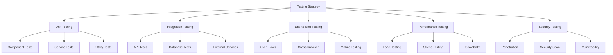

# RIMSS E-Commerce Platform - Testing Strategy

## 1. Testing Overview

### 1.1 Testing Objectives
- Ensure functionality meets requirements
- Validate business logic
- Verify data integrity
- Ensure security measures
- Validate performance metrics
- Confirm user experience

### 1.2 Testing Types


## 2. Unit Testing

### 2.1 Frontend Unit Tests
```typescript
// Product Card Component Test
describe('ProductCard', () => {
  it('renders product information correctly', () => {
    const product = {
      name: 'Test Product',
      price: 99.99,
      image: 'test.jpg'
    };
    
    render(<ProductCard product={product} />);
    
    expect(screen.getByText('Test Product')).toBeInTheDocument();
    expect(screen.getByText('₹99.99')).toBeInTheDocument();
  });
  
  it('handles add to cart action', () => {
    const onAddToCart = jest.fn();
    render(<ProductCard onAddToCart={onAddToCart} />);
    
    fireEvent.click(screen.getByText('Add to Cart'));
    expect(onAddToCart).toHaveBeenCalled();
  });
});
```

### 2.2 Backend Unit Tests
```typescript
// Auth Service Test
describe('AuthService', () => {
  it('should create JWT token', () => {
    const user = {
      _id: 'user123',
      role: 'user'
    };
    
    const token = AuthService.generateToken(user);
    const decoded = jwt.verify(token, process.env.JWT_SECRET);
    
    expect(decoded).toHaveProperty('id', 'user123');
  });
  
  it('should validate password', async () => {
    const password = 'testPass123';
    const hash = await AuthService.hashPassword(password);
    
    const isValid = await AuthService.validatePassword(password, hash);
    expect(isValid).toBe(true);
  });
});
```

## 3. Integration Testing

### 3.1 API Integration Tests
```typescript
// Product API Test
describe('Product API', () => {
  beforeEach(async () => {
    await Product.deleteMany({});
  });
  
  it('should create product', async () => {
    const response = await request(app)
      .post('/api/products')
      .send({
        name: 'Test Product',
        price: 99.99
      })
      .set('Authorization', `Bearer ${token}`);
    
    expect(response.status).toBe(201);
    expect(response.body).toHaveProperty('_id');
  });
  
  it('should get products with pagination', async () => {
    await Product.create([
      { name: 'Product 1', price: 99 },
      { name: 'Product 2', price: 199 }
    ]);
    
    const response = await request(app)
      .get('/api/products?page=1&limit=10');
    
    expect(response.status).toBe(200);
    expect(response.body.products).toHaveLength(2);
  });
});
```

### 3.2 Database Integration Tests
```typescript
// Order Repository Test
describe('OrderRepository', () => {
  beforeEach(async () => {
    await mongoose.connection.dropDatabase();
  });
  
  it('should create order with items', async () => {
    const order = await OrderRepository.create({
      user: 'user123',
      items: [
        { product: 'prod1', quantity: 2 },
        { product: 'prod2', quantity: 1 }
      ]
    });
    
    expect(order.items).toHaveLength(2);
    expect(order.status).toBe('pending');
  });
});
```

## 4. End-to-End Testing

### 4.1 User Flow Tests
```typescript
// Checkout Flow Test
describe('Checkout Flow', () => {
  it('should complete checkout process', async () => {
    // Login
    await page.goto('/login');
    await page.fill('#email', 'test@example.com');
    await page.fill('#password', 'password');
    await page.click('button[type="submit"]');
    
    // Add to cart
    await page.goto('/products');
    await page.click('button[data-testid="add-to-cart"]');
    
    // Checkout
    await page.goto('/checkout');
    await page.fill('#card-number', '4242424242424242');
    await page.fill('#card-expiry', '12/25');
    await page.fill('#card-cvc', '123');
    
    await page.click('button[type="submit"]');
    
    expect(page.url()).toContain('/order-confirmation');
  });
});
```

### 4.2 Cross-browser Testing
```typescript
// Browser Compatibility Test
describe('Browser Compatibility', () => {
  const browsers = ['chrome', 'firefox', 'safari'];
  
  browsers.forEach(browser => {
    it(`should render correctly in ${browser}`, async () => {
      const page = await browser.newPage();
      await page.goto('/');
      
      const screenshot = await page.screenshot();
      expect(screenshot).toMatchImageSnapshot();
    });
  });
});
```

## 5. Performance Testing

### 5.1 Load Testing
```typescript
// API Load Test
describe('API Load Testing', () => {
  it('should handle multiple concurrent requests', async () => {
    const requests = Array(100).fill().map(() => (
      axios.get('/api/products')
    ));
    
    const startTime = Date.now();
    const responses = await Promise.all(requests);
    const endTime = Date.now();
    
    const avgResponseTime = (endTime - startTime) / 100;
    expect(avgResponseTime).toBeLessThan(200);
  });
});
```

### 5.2 Stress Testing
```typescript
// Database Stress Test
describe('Database Stress Testing', () => {
  it('should handle bulk operations', async () => {
    const products = Array(1000).fill().map((_, i) => ({
      name: `Product ${i}`,
      price: Math.random() * 1000
    }));
    
    const startTime = Date.now();
    await Product.insertMany(products);
    const endTime = Date.now();
    
    const insertTime = endTime - startTime;
    expect(insertTime).toBeLessThan(5000);
  });
});
```

## 6. Security Testing

### 6.1 Authentication Tests
```typescript
// Auth Security Test
describe('Authentication Security', () => {
  it('should prevent unauthorized access', async () => {
    const response = await request(app)
      .get('/api/admin/users');
    
    expect(response.status).toBe(401);
  });
  
  it('should prevent password brute force', async () => {
    const attempts = Array(10).fill().map(() => (
      request(app)
        .post('/api/auth/login')
        .send({
          email: 'test@example.com',
          password: 'wrong'
        })
    ));
    
    const responses = await Promise.all(attempts);
    const lastResponse = responses[responses.length - 1];
    
    expect(lastResponse.status).toBe(429);
  });
});
```

### 6.2 Input Validation Tests
```typescript
// Input Validation Test
describe('Input Validation', () => {
  it('should prevent XSS attacks', async () => {
    const response = await request(app)
      .post('/api/products')
      .send({
        name: '<script>alert("xss")</script>',
        description: 'Test'
      });
    
    expect(response.body.name).not.toContain('<script>');
  });
  
  it('should validate file uploads', async () => {
    const response = await request(app)
      .post('/api/products/image')
      .attach('image', 'test.exe');
    
    expect(response.status).toBe(400);
  });
});
```

## 7. Test Coverage Requirements

### 7.1 Coverage Targets
- Unit Tests: 80% coverage
- Integration Tests: 70% coverage
- E2E Tests: Critical user flows

### 7.2 Coverage Report
```typescript
// Jest Coverage Configuration
module.exports = {
  coverageThreshold: {
    global: {
      statements: 80,
      branches: 80,
      functions: 80,
      lines: 80
    }
  },
  collectCoverageFrom: [
    'src/**/*.{ts,tsx}',
    '!src/**/*.d.ts'
  ]
};
```

## 8. Testing Environment

### 8.1 Test Database
```typescript
// Test Database Configuration
const setupTestDB = () => {
  beforeAll(async () => {
    await mongoose.connect(process.env.TEST_MONGODB_URI);
  });
  
  afterEach(async () => {
    await mongoose.connection.dropDatabase();
  });
  
  afterAll(async () => {
    await mongoose.disconnect();
  });
};
```

### 8.2 Mock Services
```typescript
// Payment Service Mock
const mockStripe = {
  charges: {
    create: jest.fn().mockResolvedValue({
      id: 'ch_123',
      status: 'succeeded'
    })
  }
};

jest.mock('stripe', () => jest.fn(() => mockStripe));
```

## 9. Continuous Integration

### 9.1 CI Pipeline
```yaml
# GitHub Actions Configuration
name: Test Pipeline

on: [push, pull_request]

jobs:
  test:
    runs-on: ubuntu-latest
    
    steps:
      - uses: actions/checkout@v2
      
      - name: Setup Node.js
        uses: actions/setup-node@v2
        with:
          node-version: '16'
          
      - name: Install Dependencies
        run: npm install
        
      - name: Run Tests
        run: npm test
        
      - name: Upload Coverage
        uses: codecov/codecov-action@v2
```

## 10. Test Documentation

### 10.1 Test Cases
```markdown
# Login Feature Test Cases

## Positive Cases
1. Valid credentials login
2. Remember me functionality
3. Password reset flow

## Negative Cases
1. Invalid email format
2. Wrong password
3. Account lockout
4. Rate limiting

## Edge Cases
1. Concurrent login attempts
2. Session handling
3. Token expiration
```

### 10.2 Test Reports
```typescript
// Custom Test Reporter
class CustomReporter {
  onRunComplete(contexts, results) {
    console.log('Test Suites:', results.numTotalTestSuites);
    console.log('Tests:', results.numTotalTests);
    console.log('Passes:', results.numPassedTests);
    console.log('Failures:', results.numFailedTests);
    console.log('Coverage:', results.coverage);
  }
}
``` 